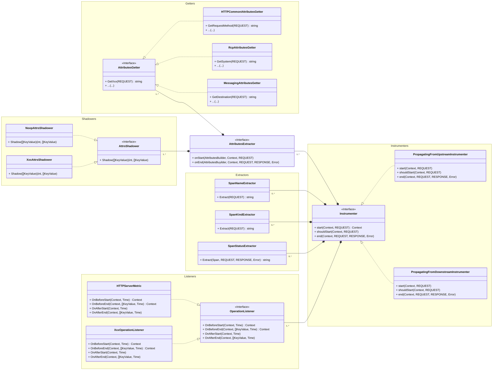
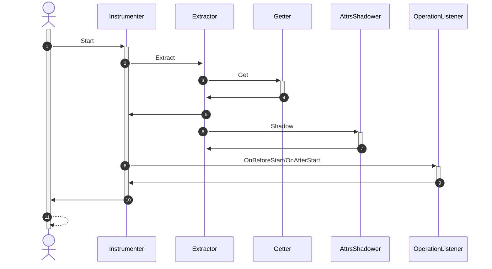

# API Design & Project Structure

The project structure is as follows:

```
internal ---> Compile-Time-Instrumentation tools
demo ---> Demo Application
pkg ---> Public API
    inst-api ---> Encapsulation of instrumentation (generating span, metrics, ...)
        instrumenter
    inst-api-semconv ---> Encapsulation of OpenTelemetry SemConv
        instrumenter
            http
            rpc
            db
            messaging
            network
sdk ---> Instrumentation code for each plugin (e.g. http, grpc, ...)
```

For Public API, we have some key abstractions as follows:

1. `Instrumenter`: Unified entrance of instrumentation (generating span, metrics, ...)
2. `Extractor`: Extracting attributes using multiple Getters according to [OpenTelemetry Semconv](https://opentelemetry.io/docs/specs/semconv/).
3. `Getter`: Getting attributes from the REQUEST object(For example, HTTPRequest object that HTTP Server received).
4. `AttrsShadower`: An extension for Extractor to customize the attributes extracted by the extractor.
5. `OperationListener`: An hook for better extension(For example, aggregate the metrics).

And the relationship between these key components is shown below:



The `Instrumenter` will hold a number of `Extractor`s and `OperationListener`s, the `Extractor` will
hold a number of `Getter`s and `AttrsShadower`s. The `Getter` extracts the important attributes of
OpenTelemetry and returns them to the `Extractor`, which then makes the necessary cuts to these
attributes through the `AttrsShadower`. After `Instrumenter` gets the necessary attributes through
`Extractor`, it will perform some callback operations through `OperationListener`, such as
aggregation of metrics etc.


