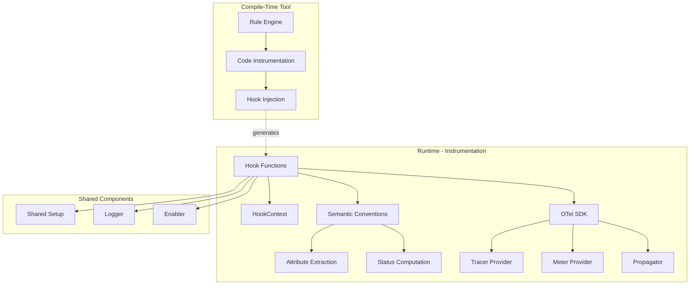

# API Design & Project Structure

The project structure is as follows:

- `demo`: Demo applications showing instrumentation in action
- `pkg`: Public API and instrumentation implementations
  - `inst`: Core instrumentation context and hook interface
  - `instrumentation`: Instrumentation implementations for each protocol/library
    - `nethttp`: HTTP client and server instrumentation
      - `client`: HTTP client hooks
      - `server`: HTTP server hooks
      - `semconv`: Semantic conventions for HTTP
    - `grpc`: gRPC instrumentation
    - `helloworld`: Example instrumentation
    - `runtime`: Runtime context management
    - `shared`: Shared utilities and OTel SDK setup
  - `otelsetup`: OpenTelemetry SDK initialization
- `tool`: Compile-time instrumentation tool
  - `internal/setup`: Setup phase, prepares the environment for instrumentation
  - `internal/instrument`: Instrument phase, applies actual instrumentation
  - `internal/rule`: Rule definitions for matching and instrumenting functions

## Architecture Overview

The instrumentation framework follows a simplified, direct approach:

### Key Components

1. **Hook Functions**: Before/After functions that wrap target code
   - `Before*` hooks: Initialize tracing, inject context, wrap parameters
   - `After*` hooks: Finalize spans, record metrics, extract results

2. **Semantic Conventions (semconv)**: Functions that extract OpenTelemetry attributes
   - Direct attribute extraction from request/response objects
   - Span status computation based on response codes
   - Error type extraction

3. **HookContext**: Interface for accessing and modifying function parameters and storing hook data
   - `GetParam(index)`: Retrieve function parameter
   - `SetParam(index, value)`: Modify function parameter (e.g., inject context)
   - `GetData()` / `SetData(data)`: Pass data between Before/After hooks
   - `GetKeyData(key)` / `SetKeyData(key, value)`: Pass keyed data between Before/After hooks
   - `HasKeyData(key)`: Check if a key exists in the hook data

4. **Shared Setup**: Common OTel SDK initialization and configuration
   - Idempotent SDK setup using `sync.Once`
   - Environment-based configuration
   - Shared logger instance

## Instrumentation Pattern

The instrumentation follows a consistent pattern across all implementations:

### HTTP Client Example

```go
// Before hook: Start span, inject context
func BeforeRoundTrip(ictx inst.HookContext, transport *http.Transport, req *http.Request) {
    // 1. Check if instrumentation is enabled
    if !clientEnabler.Enable() {
        return
    }

    // 2. Extract semantic convention attributes
    attrs := semconv.HTTPClientRequestTraceAttrs(req)

    // 3. Start span with attributes
    ctx, span := tracer.Start(req.Context(), spanName,
        trace.WithSpanKind(trace.SpanKindClient),
        trace.WithAttributes(attrs...))

    // 4. Inject trace context into request
    propagator.Inject(ctx, propagation.HeaderCarrier(req.Header))

    // 5. Update request with instrumented context
    newReq := req.WithContext(ctx)
    ictx.SetParam(requestParamIndex, newReq)

    // 6. Store data for After hook
    ictx.SetKeyData("span", span)
    ictx.SetKeyData("start", time.Now())
}

// After hook: Record results, end span
func AfterRoundTrip(ictx inst.HookContext, res *http.Response, err error) {
    // 1. Retrieve data from Before hook
    span, ok := ictx.GetKeyData("span").(trace.Span)
    if !ok || span == nil {
        return
    }
    defer span.End()

    // 2. Add response attributes
    if res != nil {
        attrs := semconv.HTTPClientResponseTraceAttrs(res)
        span.SetAttributes(attrs...)

        // Set span status
        code, desc := semconv.HTTPClientStatus(res.StatusCode)
        span.SetStatus(code, desc)
    }

    // 3. Handle errors
    if err != nil {
        span.RecordError(err)
        span.SetStatus(codes.Error, err.Error())
    }
}
```

### HTTP Server Example

```go
// Before hook: Extract context, start span, wrap response writer
func BeforeServeHTTP(ictx inst.HookContext, recv interface{}, w http.ResponseWriter, r *http.Request) {
    // 1. Extract trace context from incoming request
    ctx := propagator.Extract(r.Context(), propagation.HeaderCarrier(r.Header))

    // 2. Get semantic convention attributes
    attrs := semconv.HTTPServerRequestTraceAttrs("", r)

    // 3. Start server span
    ctx, span := tracer.Start(ctx, spanName,
        trace.WithSpanKind(trace.SpanKindServer),
        trace.WithAttributes(attrs...))

    // 4. Wrap ResponseWriter to capture status code
    wrapper := &writerWrapper{
        ResponseWriter: w,
        statusCode:     http.StatusOK,
    }
    ictx.SetParam(responseWriterIndex, wrapper)

    // 5. Store span for After hook
    ictx.SetKeyData("span", span)
    ictx.SetKeyData("start", time.Now())
}

// After hook: Extract status, finalize span
func AfterServeHTTP(ictx inst.HookContext) {
    span, ok := ictx.GetKeyData("span").(trace.Span)
    if !ok || span == nil {
        return
    }
    defer span.End()

    // Extract status code from wrapped ResponseWriter
    statusCode := http.StatusOK
    if p, ok := ictx.GetParam(responseWriterIndex).(http.ResponseWriter); ok {
        if wrapper, ok := p.(*writerWrapper); ok {
            statusCode = wrapper.statusCode
        }
    }

    // Add response attributes and set span status
    attrs := semconv.HTTPServerResponseTraceAttrs(statusCode, 0)
    span.SetAttributes(attrs...)

    code, desc := semconv.HTTPServerStatus(statusCode)
    span.SetStatus(code, desc)
}
```

## Component Relationships



## Key Design Principles

1. **Simplicity**: Direct hook functions without heavy abstractions
   - No complex instrumenter hierarchies
   - No getter/extractor/shadower patterns
   - Direct use of OTel SDK APIs

2. **Performance**: Minimal overhead in instrumentation path
   - Lazy initialization with `sync.Once`
   - Early returns when instrumentation is disabled
   - Efficient attribute allocation

3. **Flexibility**: Easy to extend and customize
   - Hook functions are plain Go functions
   - Semantic conventions are pure functions
   - No rigid frameworks to conform to

4. **Standards Compliance**: Follows OpenTelemetry specifications
   - Uses official semantic conventions
   - Proper context propagation
   - Correct span kinds and status codes

## Environment Variables

The instrumentation respects standard OpenTelemetry environment variables:

- `OTEL_EXPORTER_OTLP_ENDPOINT`: OTLP endpoint (e.g., `http://localhost:4317`)
- `OTEL_EXPORTER_OTLP_TRACES_ENDPOINT`: Traces-specific endpoint
- `OTEL_EXPORTER_OTLP_METRICS_ENDPOINT`: Metrics-specific endpoint
- `OTEL_SERVICE_NAME`: Service name for telemetry
- `OTEL_LOG_LEVEL`: Log level (`debug`, `info`, `warn`, `error`)
- `OTEL_GO_ENABLED_INSTRUMENTATIONS`: Comma-separated list of enabled instrumentations (e.g., `nethttp,grpc`)
- `OTEL_GO_DISABLED_INSTRUMENTATIONS`: Comma-separated list of disabled instrumentations (e.g., `nethttp`)

## Adding New Instrumentation

To add instrumentation for a new library:

1. Create a new directory under `pkg/instrumentation/<library>`
2. Implement Before/After hook functions
3. Create semantic convention helpers in a `semconv` subdirectory
4. Define rules in `tool/data/<library>.yaml`
5. Add tests and documentation

Example structure:

```text
pkg/instrumentation/mylibrary/
├── client/
│   ├── client_hook.go       # Before/After hooks
│   └── client_hook_test.go
├── server/
│   ├── server_hook.go
│   └── server_hook_test.go
├── semconv/
│   ├── client.go            # Client semantic conventions
│   ├── server.go            # Server semantic conventions
│   └── util.go              # Shared utilities
├── go.mod
└── README.md
```
